# 28 Top-Tier Programmatic Advertising Platforms You Must Know in 2025

You're burning through ad budget on platforms that promise qualified traffic but deliver bot clicks and zero conversions. Every marketer knows the frustration of launching campaigns that eat thousands in spend while your conversion tracking shows nothing but tumbleweeds. Whether you're running e-commerce offers that need immediate sales, affiliate campaigns in competitive verticals like dating and finance, or brand awareness pushes that actually need real eyeballs, finding programmatic advertising platforms with genuine traffic and transparent optimization tools separates profitable campaigns from money pits.

The landscape of buying website traffic has matured beyond simple CPM bidding into sophisticated ecosystems offering native ads that blend seamlessly into content, push notifications reaching opted-in audiences, and pop formats that still convert when done right. Smart advertisers now stack multiple traffic sources, testing micro-segments across geos while AI-powered bidding optimizes toward actual CPA goals rather than vanity metrics.

## **[PPCmate](https://ppcmate.com)**

Programmatic DSP marketplace aggregating traffic from multiple SSPs including MGID, NativeAds, and Google ADX into one self-serve platform with native, display, pop, and push formats.

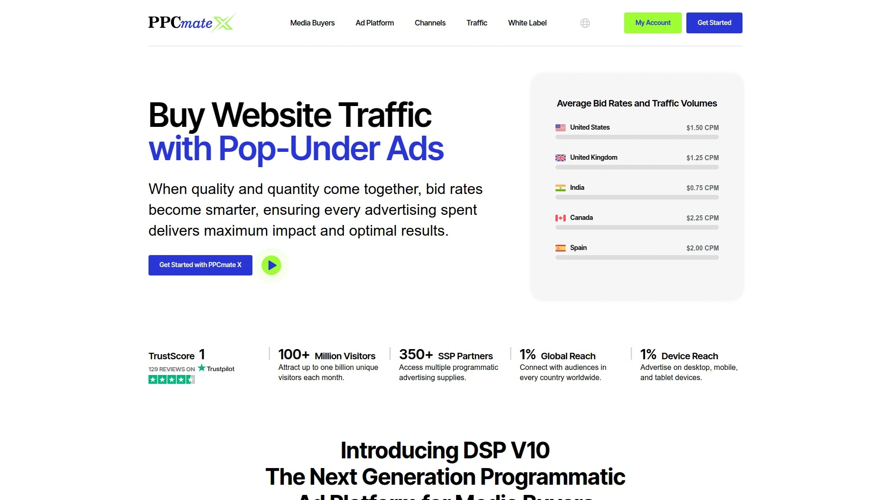

PPCmate operates as a traffic aggregator connecting advertisers to premium supply-side platforms without requiring separate accounts for each network. The platform pulls inventory from MGID, NativeAds, Nexage, Axonix, Google ADX, Mopub, and additional exchanges, letting you access diverse traffic sources through a unified dashboard. This marketplace approach saves time compared to managing relationships with dozens of individual SSPs while maintaining competitive pricing through programmatic bidding.

The self-serve interface supports native, display, pop-up, pop-under, and interstitial ad formats across desktop and mobile placements. Whether targeting local campaigns in specific cities or scaling internationally across continents, the platform offers granular geographic and device targeting. Real-time bidding technology ensures you're paying market rates rather than inflated fixed CPMs.

Zero minimum spend removes barriers to testing, letting performance marketers validate offers with small budgets before scaling winners. The platform serves advertisers across verticals including automotive, fashion, dating, e-commerce, gaming, healthcare, and financial services. Dedicated support transitions from ticket-based assistance to personal account management as campaign volumes increase.

Programmatic technology automatically optimizes bids based on performance data, routing budget toward placements generating conversions rather than just clicks. Integration capabilities connect to major tracking platforms for proper attribution. For media buyers seeking consolidated access to multiple premium traffic sources without juggling separate accounts, PPCmate streamlines multi-source testing through centralized campaign management.

## **[Taboola](https://taboola.com)**

Content discovery platform reaching 1.4 billion monthly users through partnerships with premium publishers like NBC, Bloomberg, and Fox News.

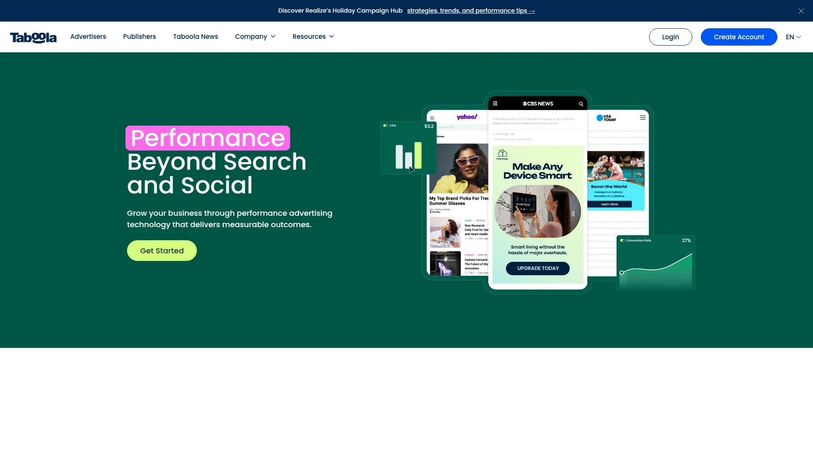

Taboola pioneered native advertising at scale, placing content recommendations on some of the web's highest-traffic sites. The platform's strength lies in its publisher relationships—when you run campaigns on Taboola, your ads appear alongside editorial content on NBC News, Business Insider, Bloomberg, CBS News, Fox News, and hundreds of other premium properties. This premium placement drives brand lift alongside direct response metrics.

Taboola Feed represents the platform's evolution into personalized content streams, functioning like an endless Facebook feed but populated with editorial and sponsored content matching user interests. Publishers embed Taboola Feed on their sites, and readers scroll through curated recommendations that include both organic content and native ads indistinguishable from editorial picks. The targeting goes beyond basic demographics into behavioral signals, letting you reach audiences based on interests, content consumption patterns, and look-alike modeling.

The self-serve platform provides campaign creation tools, bid management, creative testing frameworks, and robust analytics showing engagement beyond just clicks—time on site, scroll depth, and conversion tracking. Taboola specializes in first-tier countries like the US, UK, Japan, and France where premium traffic commands higher CPMs but converts at superior rates. Minimum budgets start accessible for testing but scale effectively for enterprise advertisers spending six figures monthly.

AI-powered optimization analyzes which combinations of creative, headline, and thumbnail drive performance, automatically allocating budget toward winning variants. For brands prioritizing premium placements and content-driven engagement over pure performance arbitrage, Taboola delivers qualified traffic from environments users trust.

## **[Outbrain](https://outbrain.com)**

Premium native advertising network with strict publisher requirements delivering 290 million native stories monthly to 1.3 billion people across 55 countries.

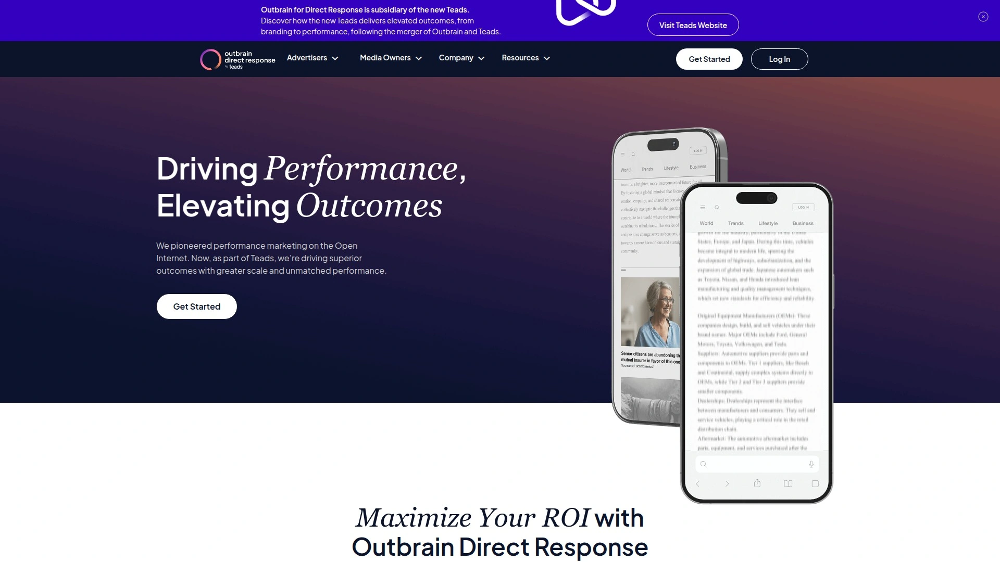

Outbrain maintains exceptionally high publisher standards—sites need minimum one million monthly visits just to qualify for the network. This selectivity ensures advertisers access genuinely premium traffic from The Guardian, CNN, MSN, Der Spiegel, and similar top-tier publishers. While the strict standards limit overall inventory compared to broader networks, the trade-off comes in traffic quality and brand-safe environments.

The platform generates 9 billion conversions annually, demonstrating that premium doesn't mean unresponsive. Campaign creation emphasizes content marketing approaches—native ads function as content recommendations that users actually click because they're genuinely interested, not tricked. Lookalike audience creation leverages Outbrain's massive data to find new users matching your best converters' characteristics.

Targeting options span geo, device, operating system, browser, interests, and advanced audience segments including retargeting capabilities. The platform provides creative analysis tools suggesting improvements to headlines, images, and landing pages based on aggregate performance data across the network. This guidance helps advertisers optimize toward proven patterns rather than guessing what resonates.

Outbrain operates on CPC pricing, letting you control costs by paying only for engaged clicks rather than impressions. The editorial environment these clicks originate from tends to drive higher-intent traffic than interruptive formats. For advertisers whose offers align with content consumption mindsets—education, finance, health, B2B services—Outbrain's premium positioning justifies the typically higher cost per click through superior conversion rates.

## **[MGID](https://mgid.com)**

Performance-focused native advertising platform founded in 2008 delivering 50 million unique visitors monthly with selective bidding across 200+ geos.

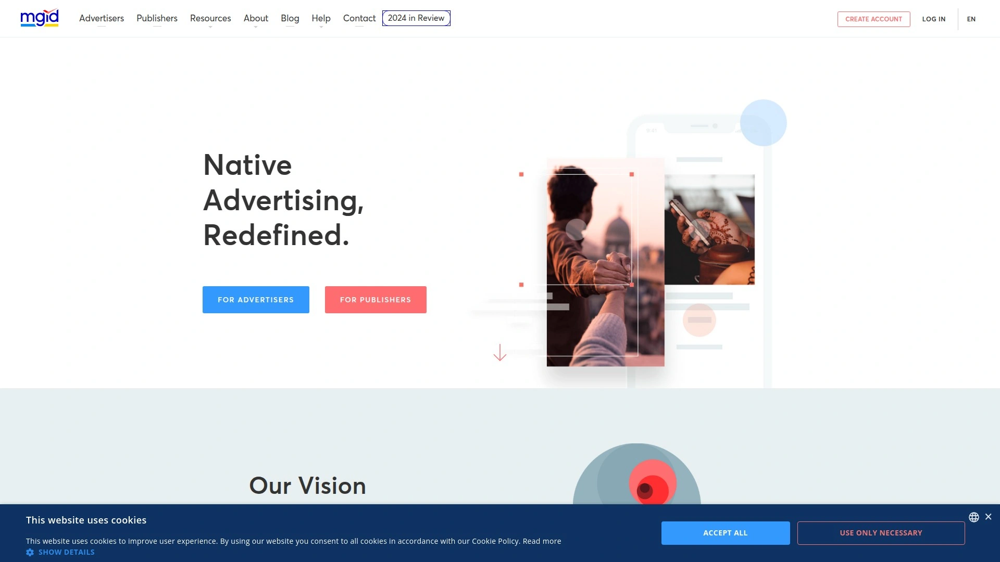

MGID positions itself as the performance alternative to premium-priced networks, offering similar native ad formats at lower costs. The platform serves recommendation widgets, header content, and sidebar placements on mid-tier publishers including International Business Times, MSN, The Week, Weather Channel, Newsweek, and HITC. While not commanding Outbrain's premium publisher roster, MGID compensates through volume and competitive pricing.

The selective bidding approach means not all traffic sources appear in every campaign—MGID filters inventory quality, showing advertisers only sources meeting performance thresholds. This pre-filtering saves testing budget wasted on low-quality placements. Campaign setup supports multiple verticals with particular strength in sweepstakes, utilities, e-commerce, and content-driven offers.

Global reach extends across Tier-1, Tier-2, and Tier-3 geos with substantial inventory in emerging markets where CPMs remain affordable. Targeting capabilities include standard options plus audience segmentation based on user behavior and interests. The self-serve platform emphasizes ease of use—campaign launch takes minutes rather than hours of configuration.

Pricing flexibility accommodates smaller budgets, making MGID accessible for affiliate marketers testing offers before committing to premium networks. Integration with tracking platforms enables proper conversion attribution. For performance marketers prioritizing ROI over brand perception and willing to test mid-tier publishers for volume, MGID delivers native traffic at prices enabling profitable scaling.

## **[PropellerAds](https://propellerads.com)**

Multi-format ad network delivering 12 billion daily impressions across 195+ geos with CPA Goal automation and Smart Bidding for hands-free optimization.

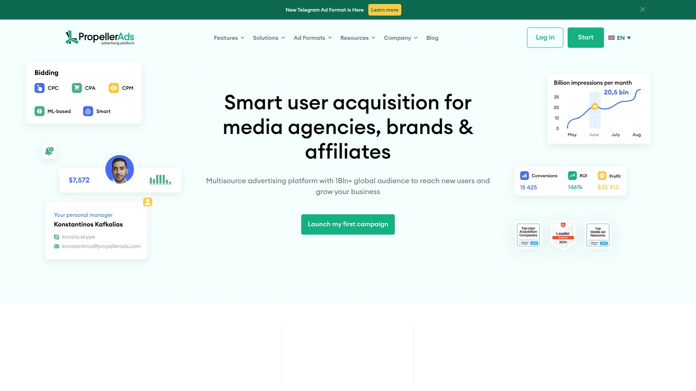

PropellerAds supports Telegram Mini Apps, Push Notifications, In-Page Push, Interstitial, Popunder, and Survey Exit formats through one dashboard. This format diversity lets advertisers match traffic type to offer—push for utilities and apps, pops for aggressive direct response, in-page for less intrusive placements. The platform's scale provides consistent inventory even in competitive verticals and geos.

CPA Goal functionality represents PropellerAds' standout feature—set your target cost per action and the algorithm automatically adjusts bids to hit that number while maintaining volume. Smart Bidding extends this automation, analyzing performance patterns to allocate budget toward times, devices, and sources generating conversions. These tools transform manual campaign management into set-and-forget scaling.

Fast approval processes get campaigns live within hours rather than days stuck in moderation queues. Detailed targeting covers geo, device, OS, browser, carrier, and custom audiences. Traffic Boosters amplify reach during testing phases or when scaling proven winners. Real-time statistics show exactly which placements perform, enabling quick source-level optimization.

The $100 minimum deposit provides substantial testing runway. Anti-fraud measures filter bot traffic and invalid clicks before they consume budget. Integration support connects to Voluum, Binom, and other tracking platforms for granular conversion tracking. For performance marketers in finance, utilities, apps, and mobile content who need automation tools preventing constant manual optimization, PropellerAds delivers volume with algorithmic efficiency.

## **[Adsterra](https://adsterra.com)**

Global ad network covering 200+ countries with Anti-Adblock technology, Social Bar format, and dedicated account managers for mid-size advertisers.

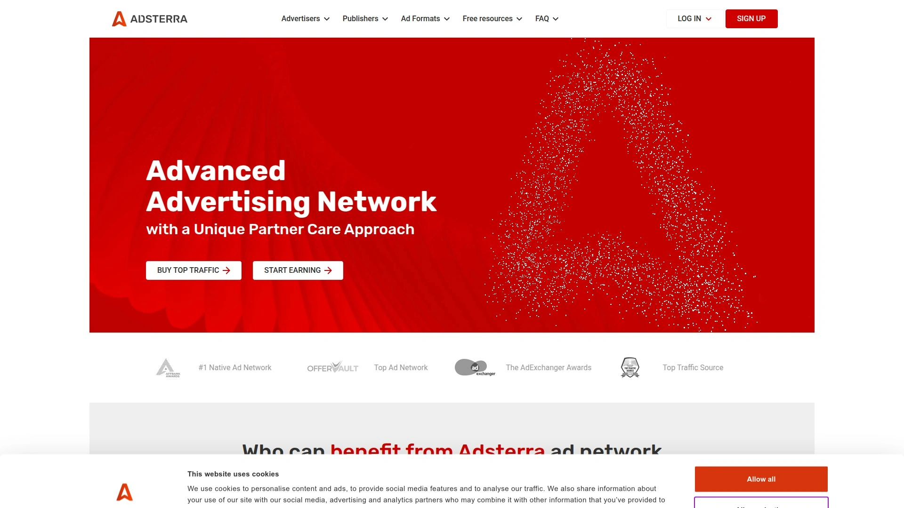

Adsterra serves popunder, in-page push, interstitial, banner, native, and the proprietary Social Bar format designed to bypass ad blockers. The Social Bar appears as a non-intrusive notification mimicking social media UI patterns, generating engagement without triggering adblocker rejection. This format addresses the universal problem of lost impressions from the 40%+ of users running blockers.

Global reach spans Tier-1 through Tier-3 geos with particularly strong inventory in dating, gambling, utilities, VPNs, finance, and software verticals. Targeting granularity includes device, OS, carrier, browser, and connection type. Anti-Adblock solutions maintain delivery rates even when users actively resist ads, recovering revenue otherwise lost entirely.

Payment models include CPM, CPC, CPA, and CPL, providing flexibility to optimize toward the metric matching your offer economics. The platform provides 24/7 live chat support with account managers assigned to advertisers hitting spending thresholds. This human touch helps troubleshoot campaign issues faster than ticket-based systems.

Minimum deposit of $100 enables meaningful testing. Integration with tracking tools allows proper conversion attribution. Publisher partners undergo vetting to maintain traffic quality standards. While not matching PropellerAds' automation sophistication or RichAds' micro-bidding capabilities, Adsterra delivers consistent volume with attentive support. For advertisers in adult, gambling, and grey-area verticals where mainstream platforms restrict campaigns, Adsterra's policies accommodate offers others reject.

## **[RichAds](https://richads.com)**

Premium push and pop traffic network with Target CPA automation, Micro Bidding by zone and site ID, and segmented traffic sources by quality tier.

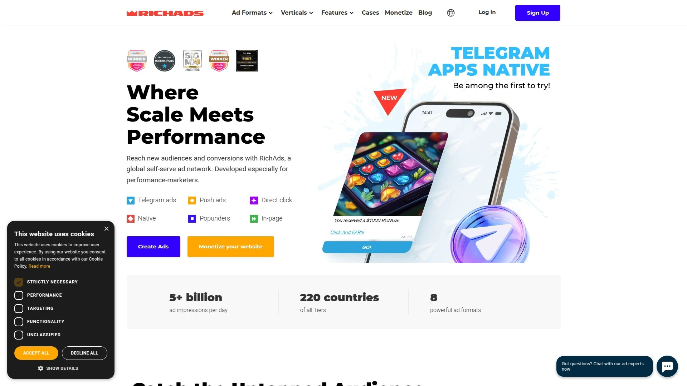

RichAds differentiates through traffic segmentation—sources are categorized by conversion potential, letting you bid different amounts for premium versus standard inventory within the same campaign. This granularity prevents overpaying for low-quality traffic while ensuring you win premium placements. Micro Bidding extends control to individual zones, site IDs, operating systems, and geos, enabling optimization beyond network averages.

Ad formats include Push, In-Page Push, Telegram Ads, Popunder, and Direct Click covering desktop and mobile traffic. The Telegram Ads format taps into the messaging platform's growing advertising potential, reaching audiences in app environments. Direct Click traffic bypasses traditional display placements, routing users directly to landing pages through various traffic mechanics.

Target CPA automation functions similarly to PropellerAds' CPA Goal—specify your acceptable cost per conversion and the algorithm adjusts bids automatically to hit that target. Automated rules create custom optimization logic based on your specific KPIs beyond just CPA. Personal account managers assist advertisers depositing $500+, providing campaign setup guidance and optimization recommendations.

Coverage spans 200+ countries with strength in Tier-1 geos including US, UK, Canada, and Western Europe. The platform excels in gambling, dating, antivirus, finance, and sweepstakes verticals. Minimum $100 deposit balances accessibility with serious advertiser filtering. For performance buyers who need clean, segmented traffic with advanced bidding controls, RichAds provides optimization depth exceeding most mainstream networks.

## **[TrafficStars](https://trafficstars.com)**

Adult and mainstream traffic network supporting popunder, banner, native, push, interstitial, and pre-roll video across 200+ geos with RTB integration.

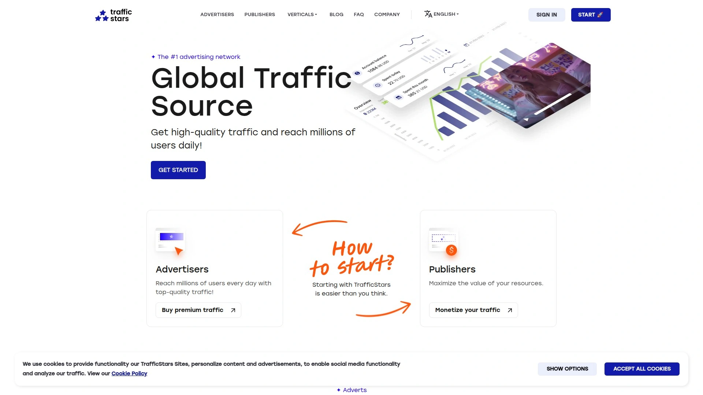

TrafficStars serves both adult and mainstream verticals, making it versatile for campaigns rejected on family-friendly networks. The platform accommodates dating, adult, gambling, and cryptocurrency offers alongside standard e-commerce and mainstream campaigns. This policy flexibility attracts performance marketers working across multiple verticals without requiring separate platform accounts.

Ad format selection includes traditional display banners, native content recommendations, push notifications, popunders, interstitials, IM-Slider overlays, and pre-roll video ads. The IM-Slider format mimics instant messenger notifications, generating engagement through familiar UI patterns. Video pre-rolls monetize video content consumption, placing 15-30 second ads before publisher videos.

RTB integration connects TrafficStars inventory to demand-side platforms and programmatic buyers operating at scale. This connectivity ensures competitive pricing through real-time bidding dynamics. Manual and automated bidding options accommodate both hands-on media buyers and set-and-forget advertisers. Targeting includes standard geo, device, and OS options plus carrier targeting for mobile campaigns.

Manager support assists with campaign setup and optimization for active advertisers. The $100 minimum deposit provides reasonable testing capacity. Traffic quality varies by source—some placements convert excellently while others waste budget, requiring source-level optimization. For adult advertisers or mainstream buyers needing policy-flexible platforms accepting controversial offers, TrafficStars removes restrictions mainstream networks enforce.

## **[Revcontent](https://revcontent.com)**

Native advertising platform with self-service dashboard, CPC and vCPM pricing, and targeting by geography, device, OS, topic, and brand.

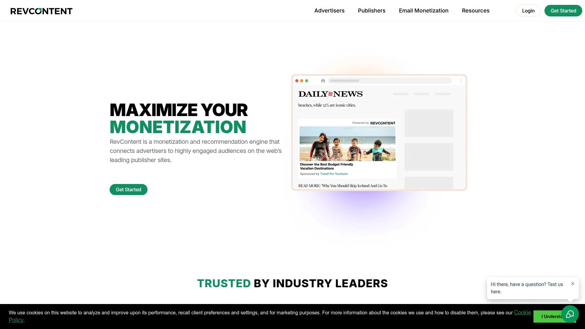

Revcontent operates a content recommendation network placing native ads on publisher sites as suggested content widgets. The self-service platform enables campaign creation, creative upload, targeting configuration, and bid management without requiring sales rep interaction. This autonomy speeds testing and optimization cycles compared to managed-service platforms.

Pricing flexibility supports both CPC and viewable CPM models, letting advertisers choose the metric aligning with campaign goals. CPC works well for direct response campaigns where clicks indicate intent, while vCPM suits brand awareness pushes measuring reach. The viewability requirement ensures impressions counted actually appeared in users' viewports rather than below the fold or on background tabs.

Targeting precision extends beyond basic geo and device into topic-based categorization, allowing campaigns to appear alongside contextually relevant content. Brand and network targeting lets you include or exclude specific publisher properties. Retargeting capabilities reconnect with users who previously engaged but didn't convert. Operating system and device-specific targeting optimizes creative and landing pages for the viewing environment.

The platform provides impression volume suitable for scaling successful campaigns beyond initial tests. Analytics track performance metrics with dashboards visualizing trends. While not matching Taboola or Outbrain's premium publisher roster, Revcontent delivers native traffic at competitive rates. For content marketers and native advertising specialists wanting self-service control, Revcontent balances ease of use with targeting sophistication.

## **[TripleLift](https://triplelift.com)**

Programmatic native advertising platform using computer vision technology to dynamically render ads matching publisher environments in real-time.

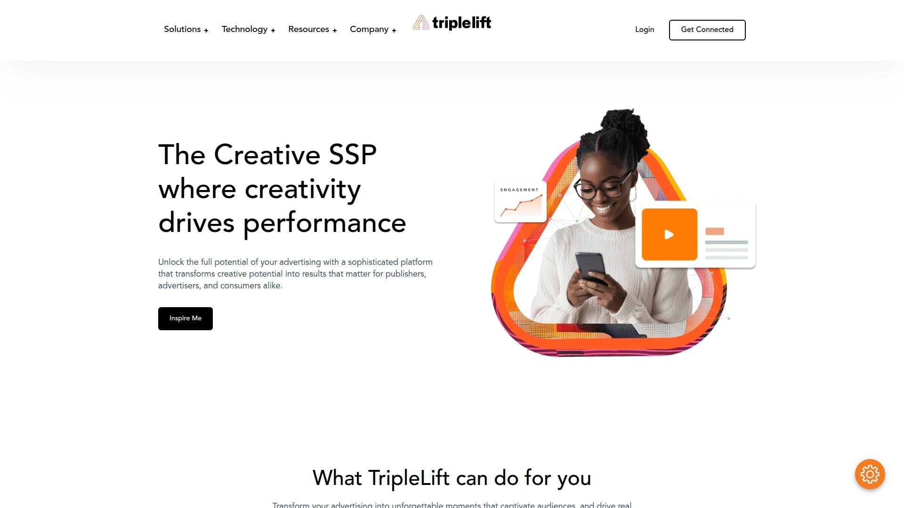

TripleLift's computer vision technology analyzes ad creatives to identify key visual elements, then dynamically generates native placements emphasizing those elements while matching publisher design patterns. This automated creative optimization ensures ads blend naturally into each placement without manual customization per publisher. The real-time rendering adapts to desktop, mobile, and tablet formats seamlessly.

Partnerships with top DSPs and publishers including CNN, USA Today, The New York Times, BBC, and eBay provide premium inventory access. The platform supports standard image ads plus 2D, 3D, and video creatives with brand overlay capabilities. Predictive modeling fills audience attribute gaps, enabling more precise targeting than relying solely on declared data.

Dynamic templating generates thousands of ad variations automatically, testing which combinations of headline, image, and call-to-action perform best in different contexts. This perpetual testing improves campaign performance over time without manual creative iteration. Integration with major programmatic ecosystems connects supply and demand efficiently.

The CPC pricing model aligns costs with engagement. Campaign previews show how ads render across different publisher environments before going live. While analytics aren't as comprehensive as some competitors, the focus remains on delivering visually cohesive native experiences. For brands prioritizing aesthetic presentation and programmatic scale, TripleLift's technology bridges creative execution with automated distribution.

## **[Nativo](https://nativo.com)**

Native advertising platform specializing in cookie-free ad delivery with Native IQ analytics serving 600 brands and 400 publishers.

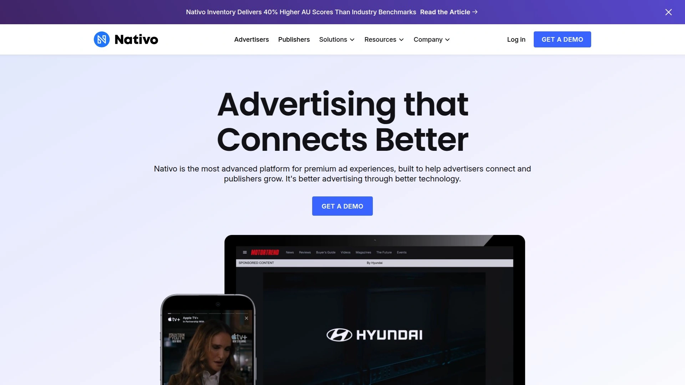

Nativo differentiates through cookie-free ad delivery, maintaining campaign performance even as users delete cookies or browse in privacy modes. This future-proofs campaigns against ongoing privacy changes and browser restrictions eliminating third-party cookie tracking. The platform uses alternative targeting signals beyond cookies to maintain audience precision.

Native IQ provides deep campaign analysis evaluating running campaigns plus competitive intelligence on how rivals' native ads perform. This benchmarking data informs creative decisions and targeting strategies based on industry-wide patterns rather than just your account performance. The analytics help identify improvement opportunities and validate whether underperformance stems from campaign execution or market conditions.

The platform serves native article ads, native display, native video, and story formats across its publisher network. Seventy-five percent of delivered ads don't rely on cookies, demonstrating the effectiveness of alternative targeting approaches. Publishers include Reuters, Coindesk, and Time among others valuing privacy-forward monetization.

Header-bidding integration optimizes publisher yield while maintaining advertiser efficiency. Traffic estimations forecast campaign reach before launch, setting realistic expectations. For brands concerned about privacy regulation impacts on audience targeting, Nativo's cookie-independent infrastructure maintains campaign viability as tracking capabilities erode.

## **[ExoClick](https://exoclick.com)**

Adult and mainstream ad network delivering pop, native, banner, interstitial, and video formats across 180+ geos with RTB technology.

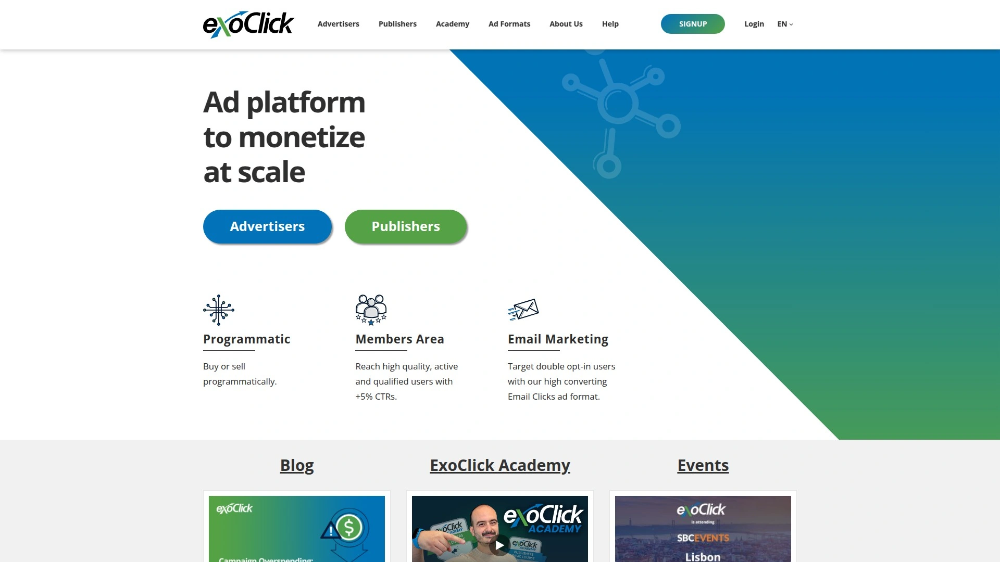

ExoClick serves adult entertainment, mainstream, and dating verticals with policy flexibility accommodating offers restricted on conservative platforms. The network provides substantial daily impression volume across popunder, native, display banners, interstitial, and video formats. This format variety enables testing which presentation style converts best for specific offers.

RTB infrastructure connects buyers through programmatic interfaces beyond the self-serve dashboard. XML feeds enable external platforms to bid on ExoClick inventory in real-time. Targeting options include geo, device, OS, browser, connection type, and carrier. Source-level reporting shows which placements perform, enabling optimization toward profitable inventory.

The $200 minimum deposit exceeds budget-conscious networks but filters tire-kickers. Support operates through ticket systems rather than dedicated managers for standard accounts. While ExoClick pioneered adult ad tech and maintains strong market position, newer competitors increasingly match capabilities while offering automation tools ExoClick lacks.

The network works for established adult advertisers or mainstream buyers comfortable with less hand-holding. Those needing AI optimization, micro-bidding, or CPA automation should explore alternatives like RichAds or PropellerAds. For volume in adult verticals or mainstream campaigns accepting adult network placement, ExoClick delivers proven inventory despite aging interface and limited automation.

## **[7Search PPC](https://7searchppc.com)**

Multi-vertical advertising network offering native, banner, popunder, text, and video ads with CPC and CPM pricing across global geos.

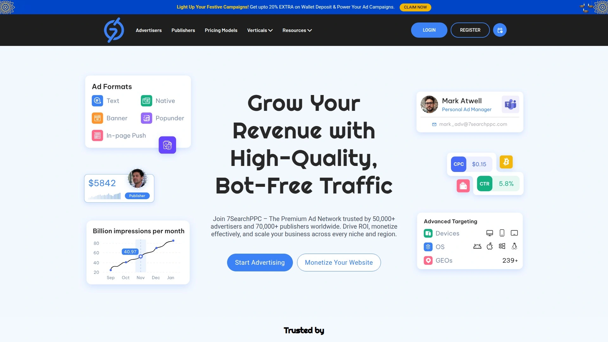

7Search PPC supports diverse verticals including iGaming, adult, crypto, finance, dating, travel, healthcare, real estate, tech support, media, e-commerce, logistics, non-profits, VPN, software, and eLearning. This vertical breadth makes it a one-stop platform for agencies and media buyers managing campaigns across multiple niches without juggling specialized networks per vertical.

Ad formats include native ads, banner display, popunder, text ads, and video placements. The native format selection provides content recommendation widgets and in-feed placements blending with publisher content. CPC and CPM pricing models accommodate both performance and branding objectives. Campaign scheduling controls when ads run, optimizing budget allocation toward high-converting dayparts.

Advanced targeting options include geo, device, operating system, browser, language, and audience segmentation. Integrated anti-fraud measures filter invalid traffic before it consumes budget. Time tracking provides visibility into agent productivity and campaign delivery pacing. The large publisher pool ensures consistent impression availability.

Affiliates, ad agencies, media buyers, direct advertisers, and performance marketers use the platform for its versatility. Easy setup and engaging ad formats lower the learning curve. For advertisers needing one platform handling multiple verticals with transparent quality standards, 7Search PPC consolidates campaign management efficiently.

## **[Zeropark](https://zeropark.com)**

Performance traffic platform specializing in pop, domain redirect, and push traffic with over 60 billion monthly impressions across all geos.

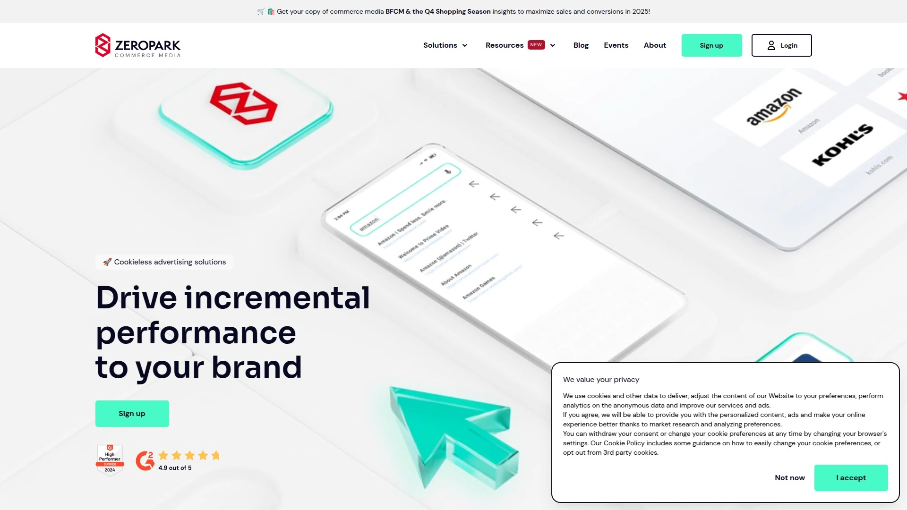

Zeropark has served performance and affiliate marketers since 2011 with focus on high-volume, conversion-oriented traffic sources. The platform's inventory size remains its primary competitive advantage—60+ billion monthly impressions ensure campaigns never face inventory constraints even when scaling aggressively. Quality traffic from Tier-1, Tier-2, and Tier-3 geos provides options matching various offer economics.

The platform emphasizes ease of use, enabling quick campaign setup and launch. Competitive pricing makes testing affordable even for affiliate marketers operating on thin margins. Pop traffic formats include traditional popunders and popups, domain redirect traffic routes users through parked domains, and push notifications reach opted-in audiences.

Source-level granularity shows which specific placements generate conversions, enabling rapid optimization. The platform attracts thousands of advertisers due to reliable inventory quality and straightforward interface. While lacking some advanced features competitors offer, Zeropark delivers core functionality without unnecessary complexity.

Minimum deposits remain accessible for testing. Integration with tracking platforms enables proper conversion attribution and optimization. For affiliates and performance marketers prioritizing inventory scale and competitive pricing over advanced automation, Zeropark provides proven traffic that's converted for thousands of advertisers over 14 years.

## **[HilltopAds](https://hilltopads.com)**

Multi-format ad network with onclick popunder, in-page push, banner, and video formats plus 24/7 live chat support and anti-fraud focus.

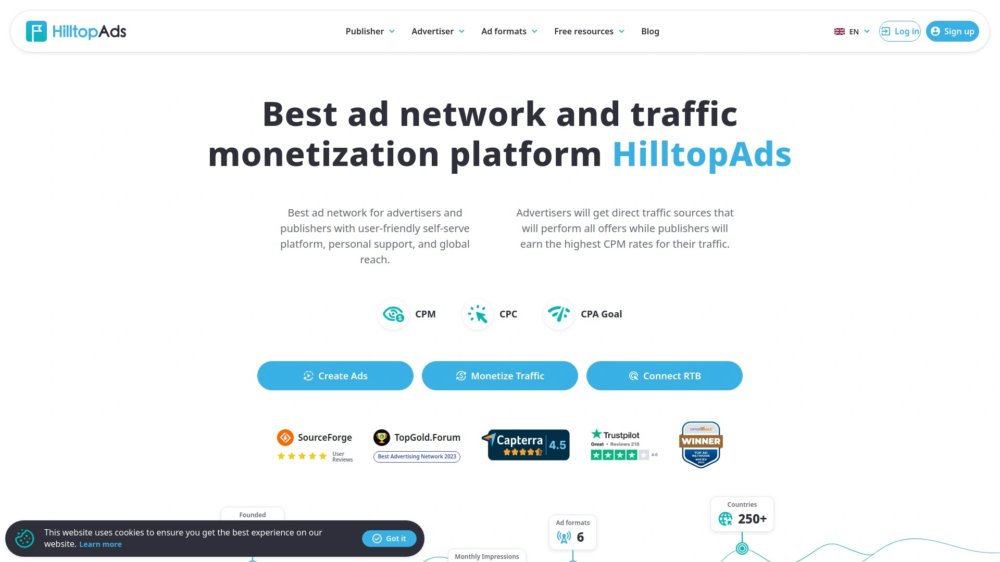

HilltopAds supports onclick (popunder), in-page push, banner, and video ad formats across 180+ geos. The onclick format triggers pop traffic on user interaction rather than page load, improving engagement metrics compared to automatic pops. In-page push notifications appear within web pages without requiring browser subscription opt-ins, expanding reach beyond push notification audiences.

The $50 minimum deposit makes testing accessible for budget-conscious advertisers. 24/7 live chat support provides immediate assistance rather than waiting for ticket responses. This responsive support helps troubleshoot issues preventing campaign delivery or tracking problems killing profitability.

Anti-fraud technology filters bot traffic and invalid clicks before they impact campaign metrics. Publisher quality varies, requiring source-level optimization to identify profitable placements. Manual bidding provides full control over spend allocation. While automation tools remain limited compared to PropellerAds or RichAds, HilltopAds compensates through attentive support and clean traffic.

The platform works for affiliates and performance marketers comfortable with hands-on optimization who value responsive support. Global reach ensures inventory availability across verticals. For advertisers wanting personal assistance and anti-fraud focus at budget-friendly entry costs, HilltopAds delivers solid fundamentals.

## **[MediaGo](https://mediago.com)**

Deep learning-based intelligent advertising platform with programmatic bidding, creative optimization, and multi-vertical reach.

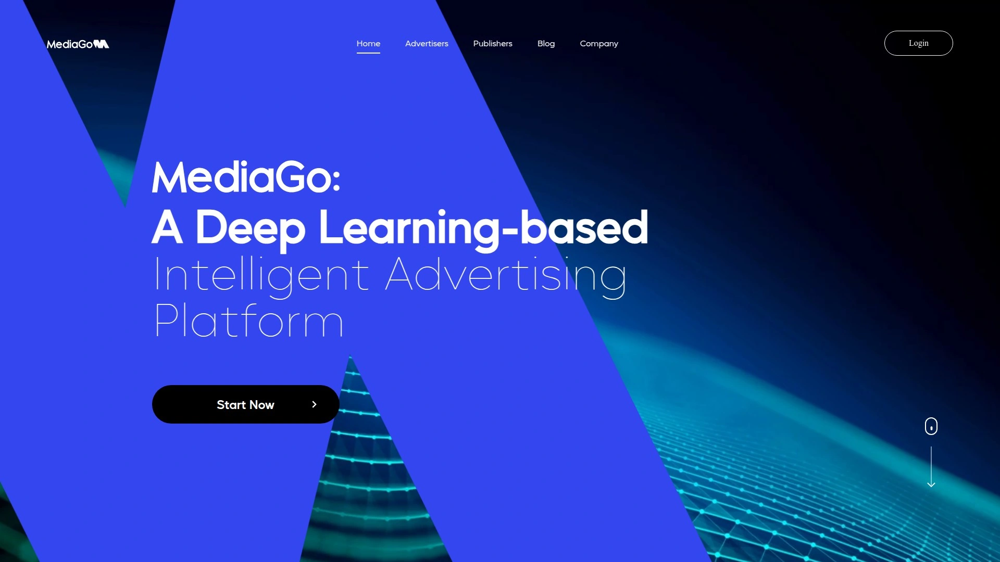

MediaGo employs deep learning algorithms to optimize campaign performance automatically. The AI analyzes which creative materials, audiences, and placements drive conversions, reallocating budget toward winners while pausing underperformers. This intelligence reduces manual optimization workload while improving results over time.

The platform enables testing creative materials with minimal budget, identifying users most likely to convert before scaling spend. This cost-efficient validation prevents wasting budgets on untested creatives or audiences. Programmatic bidding ensures competitive pricing through real-time auctions.

Case studies demonstrate measurable results—Xevio reduced cost per lead 20% below targets using MediaGo's optimization capabilities. The platform serves advertisers across verticals needing performance-driven traffic with minimal manual intervention. Integration capabilities connect to tracking systems for proper conversion attribution.

While less widely known than Taboola or Outbrain, MediaGo's technology-first approach appeals to data-driven marketers. The learning algorithms improve with scale, making it increasingly effective as campaigns accumulate performance data. For advertisers prioritizing AI optimization over brand-name recognition, MediaGo delivers intelligent automation at competitive rates.

## **[Xevio](https://xevio.io)**

Native advertising performance enabler combining creative teams with global media buying expertise for results-driven campaigns.

Xevio positions itself as a performance enabler rather than simple traffic source, coupling in-house creative production with media buying execution. This integrated approach ensures ad creatives match network requirements and audience preferences before campaigns launch. The creative teams understand what works across different native platforms and verticals.

Global media buying expertise spans major native advertising networks, enabling multi-platform campaigns managed through Xevio's coordination. This consolidated service appeals to brands and agencies lacking internal media buying resources. The performance focus aligns incentives—Xevio succeeds when campaigns hit KPI targets.

Case studies demonstrate 20%+ improvements over target CPLs through strategic testing and optimization across platforms. The combination of creative production and media buying removes the common disconnect where beautiful ads fail because they weren't designed for performance, or effective media buying stumbles due to weak creatives.

Service model suits brands, agencies, and advertisers wanting managed services rather than self-serve platforms. Pricing likely reflects the bundled creative and media buying value rather than pure traffic costs. For marketers needing both creative production and traffic expertise without building internal teams, Xevio provides turnkey native advertising execution.

## **[BidVertiser](https://bidvertiser.com)**

Long-established ad network offering pop, banner, native, and display formats with pre-screened traffic sources and 100% ad fill rate.

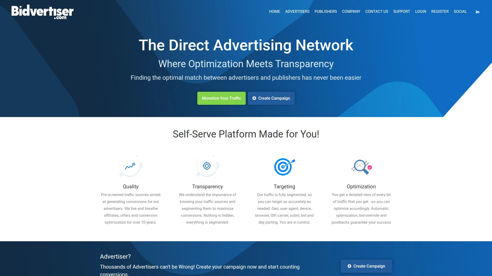

BidVertiser has operated since the early 2000s, making it one of the industry's veterans. The platform provides traditional banner display, native content recommendations, popunder traffic, and various ad sizes. This format flexibility accommodates different monetization strategies and campaign objectives.

Pre-screened traffic sources filter low-quality inventory before it reaches advertisers. This vetting maintains baseline quality standards, though individual source performance still requires testing and optimization. The 100% ad fill rate ensures inventory consistently available without campaigns pausing due to traffic shortages.

High conversion rates are claimed across verticals, though actual performance depends on offer quality and targeting precision. The network serves both advertisers buying traffic and publishers monetizing inventory. Integration capabilities connect to standard tracking platforms.

While BidVertiser lacks the scale of PropellerAds or Adsterra, the platform's longevity demonstrates consistent service delivery. Aging interface and limited automation place it behind newer competitors technologically. For advertisers comfortable with traditional ad network experiences and not requiring cutting-edge features, BidVertiser provides steady traffic from an established provider.

## **[Clickadu](https://clickadu.com)**

Global ad network specializing in popunder, banner, in-page push, instant text message, video pre-roll, and SKIM formats.

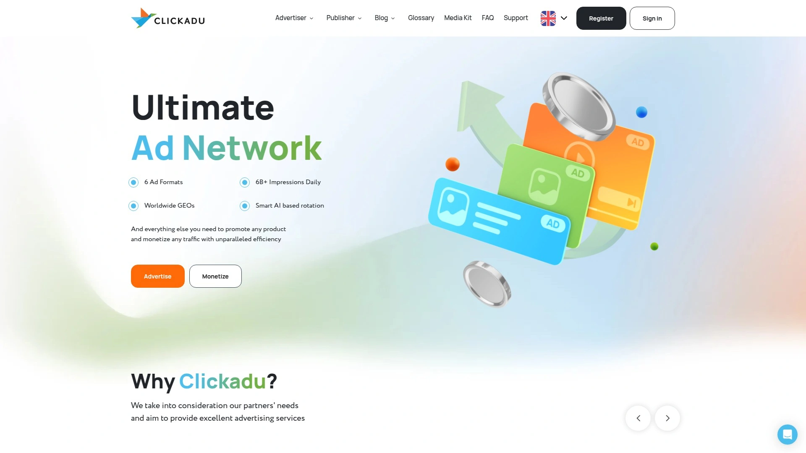

Clickadu offers diverse ad formats including traditional popunders, display banners, in-page push notifications, instant text messages, video pre-roll ads, and the proprietary SKIM format. Format variety enables testing which presentation style converts best for specific offers and audiences. The instant text message format mimics SMS notifications, generating engagement through familiar communication patterns.

Global geo coverage ensures inventory across Tier-1 through Tier-3 countries. Account managers assist advertisers with campaign setup and optimization guidance. The platform uses Smart CPM bidding that automatically adjusts to maintain delivery at target costs, though this falls short of full CPA-based automation competitors offer.

The $100 minimum deposit balances accessibility with serious advertiser filtering. Integration with tracking platforms enables conversion attribution and optimization. Publisher quality varies, requiring source-level analysis to identify profitable placements. Support responsiveness helps troubleshoot issues affecting campaign performance.

The network works for performance marketers testing pop and display traffic across multiple geos. While not leading in innovation or automation, Clickadu provides consistent inventory at competitive prices. For media buyers wanting reliable volume without requiring advanced features, Clickadu delivers functional campaign execution.

## **[PopAds](https://popads.net)**

Popunder-only traffic network with $10 minimum deposit focusing exclusively on pop traffic across 100+ geos.

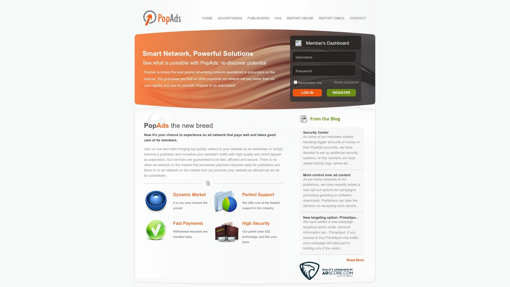

PopAds specializes exclusively in popunder traffic, eliminating format confusion and platform bloat. The laser focus on pops attracts advertisers specifically seeking this traffic type without navigating dashboards designed for multiple formats. Simplicity speeds campaign setup and reduces learning curves.

The $10 minimum deposit represents the lowest entry barrier among reputable networks. This accessibility enables testing with minimal financial commitment. Coverage spans 100+ countries providing inventory options across various geos. The network operates self-serve without account managers or live support, relying on ticket and email assistance.

Optimization tools remain limited—no AI bidding, no CPA automation, no advanced rules engines. Manual optimization requires hands-on source-level analysis. Despite these limitations, the network maintains popularity through competitive pricing and consistent inventory. Fast approval processes get campaigns live quickly.

For affiliate marketers and performance buyers specifically wanting popunder traffic at budget prices without caring about automation or support, PopAds delivers basic functionality well. The platform won't hand-hold or optimize automatically, but experienced buyers comfortable with manual optimization find value in the low costs and straightforward approach.

## **[RollerAds](https://rollerads.com)**

Push and in-page push specialist offering global traffic with $50 minimum deposit and simple interface for quick campaign launch.

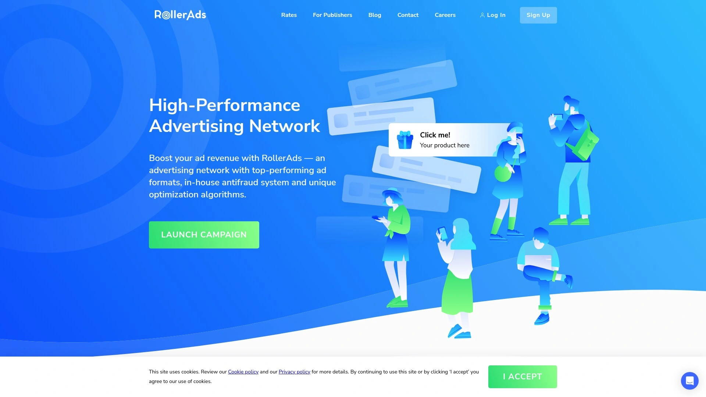

RollerAds focuses exclusively on push notification and in-page push formats. This specialization delivers deep expertise in these traffic types without the distraction of managing multiple formats. The platform works well for utility offers, software downloads, dating, and sweepstakes campaigns where push traffic performs strongly.

Global geo coverage emphasizes Tier-2 and Tier-3 countries where push traffic remains less saturated than premium geos. Lower competition in these markets often yields better ROI than expensive Tier-1 inventory. Targeting options include geo, OS, browser, device, connection type, and user activity segmentation.

The $50 minimum deposit enables testing without major investment. Custom bidding per source provides optimization control. Fast moderation approves campaigns quickly. Real-time statistics show performance metrics for rapid optimization decisions. Transparent traffic segmentation helps identify quality sources.

The simple interface reduces complexity, enabling quick campaign setup even for newcomers. While RollerAds lacks sophisticated automation tools like RichAds' Target CPA, the straightforward approach appeals to media buyers wanting clean push traffic without feature overload. For push-focused campaigns in Tier-2/3 geos at budget-friendly prices, RollerAds delivers focused functionality.

## **[UseViral](https://useviral.com)**

Website traffic service providing targeted visitors with focus on authentic engagement and geo-targeting options.

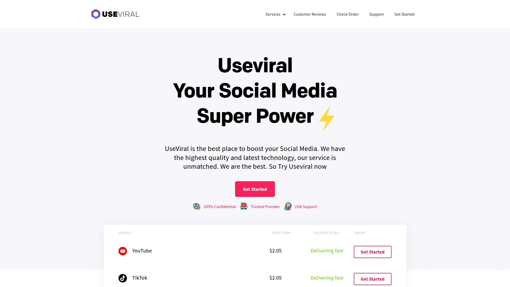

UseViral provides website traffic services emphasizing authenticity and targeting precision. The platform enables advertisers to specify visitor sources, geographic targeting, and niche alignment ensuring traffic matches site content and conversion goals. This targeting prevents wasted spend on irrelevant visitors unlikely to engage.

The service functions differently from self-serve ad platforms—you purchase traffic packages rather than managing campaigns through bidding dashboards. This simplified approach appeals to small businesses and bloggers wanting visibility boosts without learning complex advertising interfaces. Traffic delivery occurs gradually over specified timeframes, maintaining natural growth patterns.

Geo-targeting ensures visitors originate from countries matching your target market. Interest-based targeting routes traffic from users interested in your niche. Real human visitors browse sites authentically rather than bot-generated fake traffic. Customer support assists with package selection and delivery monitoring.

Pricing varies based on traffic volume, targeting specificity, and delivery speed. The model suits website owners focused on metrics like visitor counts and pageviews rather than direct conversions. For bloggers, affiliate sites, and businesses wanting to boost visibility metrics and establish social proof, UseViral delivers packages simplifying traffic acquisition.

## **[SidesMedia](https://sidesmedia.com)**

Affordable traffic provider offering safe visitor delivery, bundle packages, and add-on services for comprehensive growth.

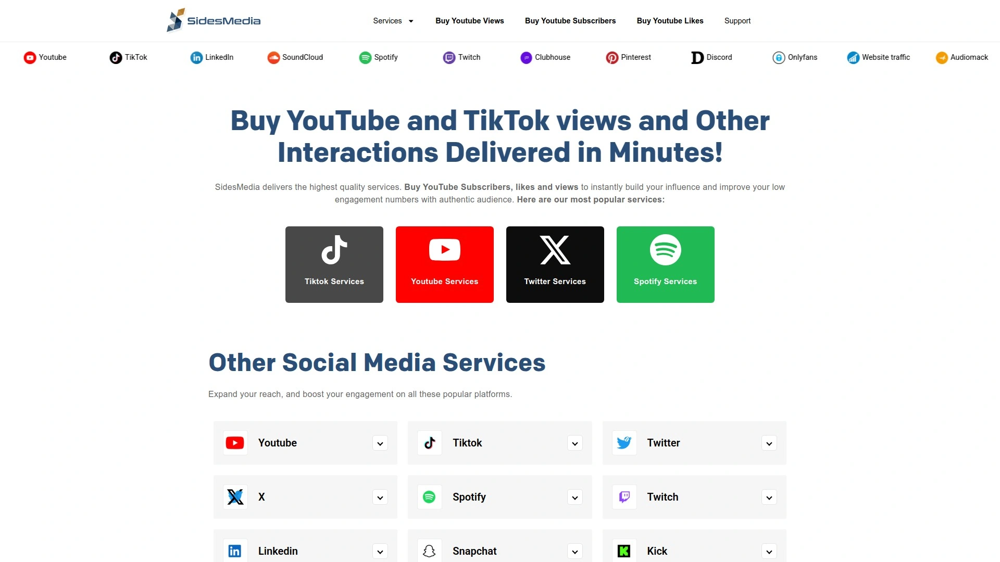

SidesMedia positions itself as budget-friendly alternative delivering authentic website visitors at accessible prices. The platform emphasizes safety, using methods complying with platform policies to avoid penalties or account restrictions. Traffic delivery maintains natural patterns preventing sudden spikes that trigger algorithmic scrutiny.

Bundle packages combine website traffic with other engagement services, creating comprehensive growth strategies. These combos suit businesses wanting to boost multiple metrics simultaneously—website visitors, social engagement, and email subscribers. The integrated approach simplifies vendor management compared to coordinating separate services per metric.

Targeting options enable geographic and interest-based visitor routing matching your audience profile. Delivery schedules spread traffic across days or weeks, maintaining realistic growth trajectories. Real visitor authentication ensures humans browse sites rather than bots inflating metrics without genuine engagement.

Customer support helps select appropriate packages for specific goals and budgets. Pricing remains affordable for small businesses and startups operating with limited marketing budgets. For businesses prioritizing cost-effectiveness and wanting simple traffic delivery without campaign complexity, SidesMedia provides straightforward packages.

## **[Growthoid](https://growthoid.com)**

Niche targeting specialist delivering traffic matching audience interests for higher conversion potential and long-term growth.

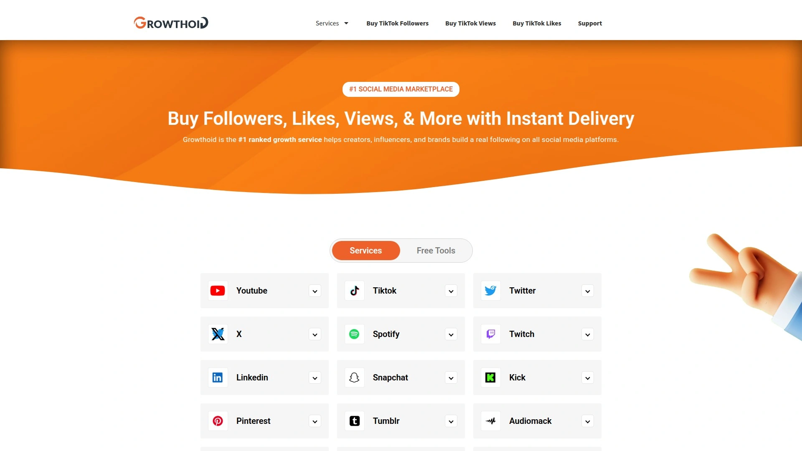

Growthoid differentiates through niche targeting precision, delivering visitors genuinely interested in specific topics rather than random traffic. This targeting dramatically improves conversion potential—an e-commerce store selling fitness equipment receives visitors interested in fitness, not random browsers. The relevance translates to better engagement metrics and higher sales likelihood.

Strong packages for long-term growth focus on sustainable audience building rather than temporary traffic spikes. The approach aligns with businesses building lasting customer relationships versus quick wins. Targeted delivery creates audiences more likely to return, subscribe, and convert over time.

Interest-based routing analyzes visitor behavior and preferences, matching them to appropriate sites. This behavioral targeting exceeds basic demographic segmentation. Geographic and demographic filters further refine audience fit. Real human visitors engage authentically with content.

The platform suits e-commerce businesses, B2C services, and content publishers where audience relevance directly impacts business outcomes. Pricing reflects the targeting sophistication and quality focus. For businesses treating website traffic as audience development rather than vanity metrics, Growthoid's targeted approach delivers visitors worth converting.

## **[Twesocial](https://twesocial.com)**

Budget-friendly traffic service combining website visitors with engagement services for all-in-one growth strategy.

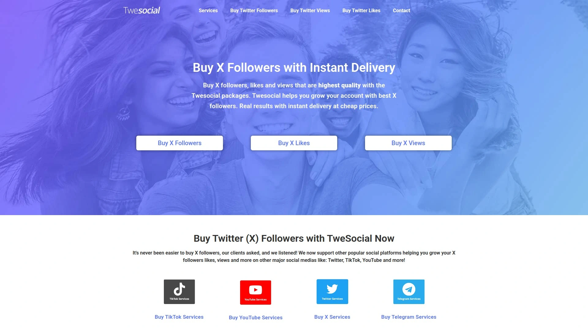

Twesocial caters to budget-conscious buyers wanting authentic traffic without premium pricing. Small businesses and bloggers operating with limited marketing budgets find the affordable packages accessible. The platform maintains quality standards despite lower pricing, delivering real visitors rather than bot traffic.

Bundled options combine website traffic with social media engagement, email list building, and other growth services. This all-in-one approach simplifies growth strategy execution through single vendor relationship. Package deals often provide better value than purchasing services separately.

Delivery safety ensures traffic arrives through compliant methods protecting site reputation. Geographic targeting routes visitors from relevant markets. Gradual delivery pacing maintains natural growth patterns. Customer support assists with package selection matching goals and budgets.

The service works for startups, new blogs, and small businesses establishing initial web presence. While not offering the targeting sophistication of Growthoid or platform control of self-serve networks, Twesocial delivers basic traffic acquisition without complexity. For beginners wanting simple traffic boosts at low prices, Twesocial removes technical barriers.

## **[TokUpgrade](https://tokupgrade.com)**

Long-term growth specialist delivering steady traffic over time with personalized support for sustainable results.

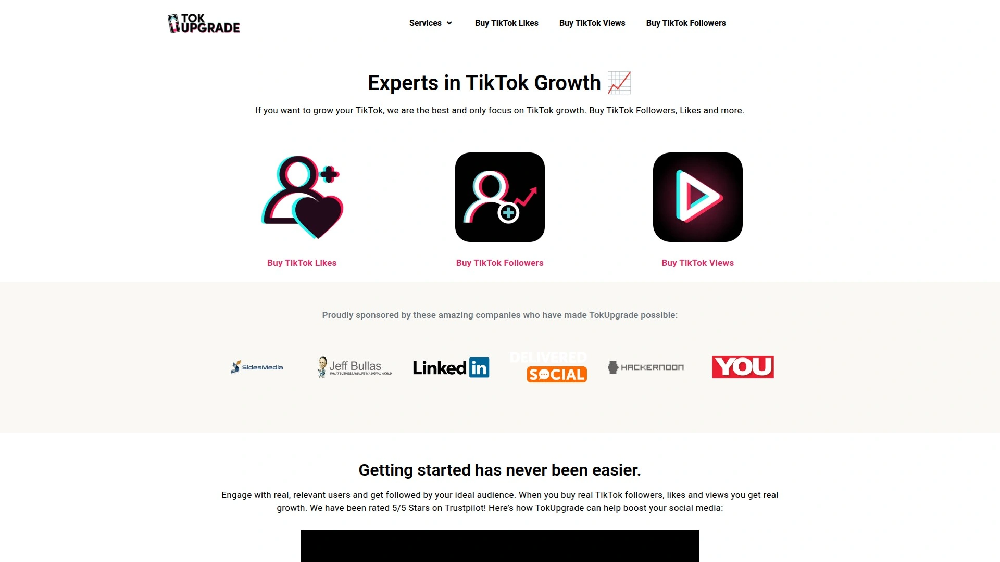

TokUpgrade emphasizes consistent, long-term traffic delivery rather than sudden spikes. Traffic spreads naturally across weeks and months, creating sustainable growth patterns healthy for site metrics and search engine perception. This approach prevents the suspicious sudden traffic surges that can trigger algorithmic penalties.

Personalized support helps buyers select packages aligning with website goals—sales focus, signups, brand awareness, or other objectives. Customer success teams provide guidance on optimizing landing pages and conversion funnels to maximize traffic value. This consultative approach adds value beyond simple visitor delivery.

Real visitor quality ensures authentic human browsing behavior. Targeting options match visitors to site content and conversion goals. Steady delivery maintains momentum, preventing the feast-or-famine traffic patterns disrupting planning and resource allocation.

The platform suits businesses building sustainable online presence versus quick experiments. Longer engagement cycles develop returning visitor bases. Pricing reflects the ongoing service model rather than one-time traffic blasts. For businesses treating traffic as long-term asset building, TokUpgrade's consistent delivery model supports strategic growth.

## **[RealTrafficSource](https://realtrafficsource.com)**

B2B lead generation traffic provider emphasizing revenue enhancement alongside visibility for business-focused campaigns.

RealTrafficSource targets B2B advertisers seeking leads and business outcomes rather than consumer traffic. The platform delivers visitors interested in business services, software, and B2B solutions. This targeting improves lead quality for companies selling to other businesses rather than end consumers.

Revenue focus distinguishes RealTrafficSource from visibility-only providers—campaigns aim to generate sales and leads, not just pageview metrics. The business-oriented traffic demonstrates higher intent and purchasing authority. Targeting options include industry, company size, and job role segmentation.

Trusted provider reputation comes from consistent delivery meeting business client expectations. B2B campaigns require higher traffic quality than consumer campaigns since deal sizes and sales cycles differ dramatically. The platform understands these dynamics, delivering accordingly.

Integration capabilities connect traffic campaigns to CRM systems and marketing automation platforms common in B2B environments. Analytics track beyond vanity metrics to actual business impact. For B2B companies, SaaS providers, and business service firms needing qualified traffic rather than random visitors, RealTrafficSource specializes in business-focused delivery.

## **[TargetedWebTraffic](https://targetedwebtraffic.com)**

US-based traffic provider with 24 years of experience delivering targeted visitors to advertisers across multiple industries.

TargetedWebTraffic's 24-year operating history demonstrates longevity rare in online advertising. The US-based company provides stability and accountability often lacking in offshore providers. Experience accumulated over decades informs traffic quality standards and delivery reliability.

Targeted traffic delivery ensures visitors match advertiser specifications—geography, interests, demographics, and browsing behavior. The precision prevents wasted budget on irrelevant traffic. Multiple industry verticals are served, from e-commerce and professional services to local businesses and national brands.

Digital marketing expertise extends beyond simple traffic delivery into strategic guidance helping clients maximize visitor value. Consultation services assist with landing page optimization, conversion rate improvement, and campaign strategy. This value-add positions TargetedWebTraffic as partner rather than just vendor.

Transparent reporting shows traffic sources, visitor behavior, and campaign performance. Customer support maintains US business hours with responsive assistance. Pricing reflects the quality focus and extensive experience. For advertisers prioritizing established providers with proven track records, TargetedWebTraffic's longevity and US presence offer reassurance.

## **[SeoVisitor](https://seovisitor.net)**

Multi-service traffic provider specializing in search engine traffic, keyword-based visitors, and social traffic generation.

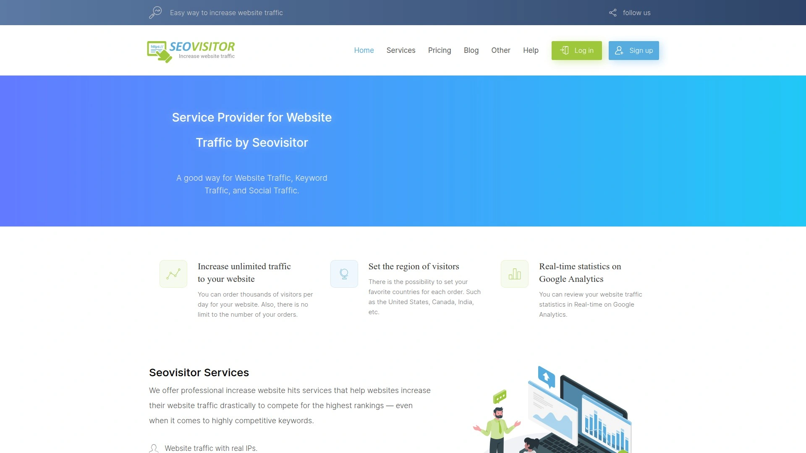

SeoVisitor provides multiple traffic types through one platform—organic search traffic, keyword-specific visitors, and social media referrals. This variety enables testing which traffic source converts best for specific offers. Search engine traffic arrives through keyword targeting, mimicking organic SEO results without months-long optimization campaigns.

Keyword traffic targeting delivers visitors searching specific terms related to your offering. This intent-based targeting improves conversion likelihood dramatically compared to random visitors. Social traffic originates from social platforms, bringing the engagement characteristics of social media audiences.

The platform suits businesses wanting to supplement organic traffic with paid visitors displaying similar characteristics. Testing keyword traffic validates SEO investment potential before committing to long-term optimization. Social traffic tests social media marketing viability without building organic followings first.

Geographic targeting routes traffic from relevant markets. Delivery controls pace traffic arrival preventing unnatural spikes. Analytics show visitor behavior and engagement metrics. For businesses exploring multiple traffic channels simultaneously, SeoVisitor's multi-source approach enables comparative testing through one provider.

## **[SparkTraffic](https://sparktraffic.com)**

Budget website traffic provider starting at $9.90 with free trial offering fraction-of-a-cent pageview costs for volume buyers.

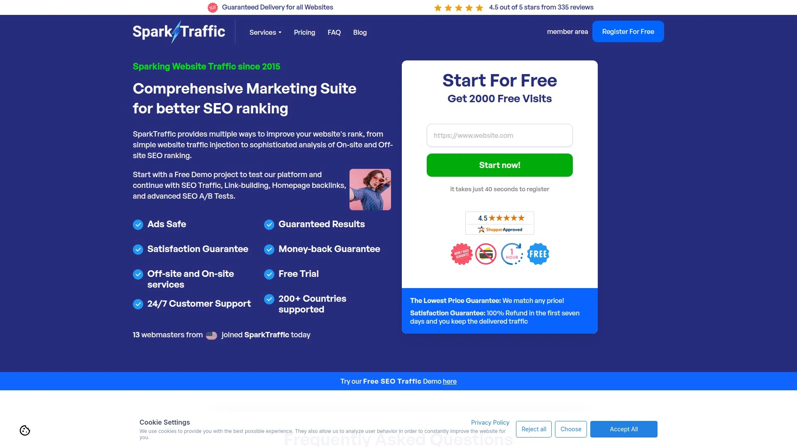

SparkTraffic emphasizes extreme affordability, positioning itself as the cheapest website traffic source. Pricing starts at $9.90 for entry packages with costs dropping to fractions of cents per pageview for volume buyers. This pricing enables testing with minimal investment and scales economically for high-volume needs.

Free trial allows testing traffic quality before financial commitment. The trial removes risk for skeptical buyers concerned about traffic authenticity. Geographic targeting, traffic volume controls, and delivery scheduling provide basic campaign management capabilities.

The platform suits website owners focused primarily on traffic volume metrics rather than conversion optimization. Blogs building readership numbers, new sites establishing baseline traffic, and businesses wanting vanity metric improvements find value in the extreme affordability. Traffic quality trades off against cost—expectations should align with pricing.

Simplicity characterizes the interface and process—select traffic volume, choose geography, start delivery. No complex campaign management or optimization features. For absolute budget constraints where any traffic beats no traffic, SparkTraffic removes cost barriers completely.

## FAQ

**How do programmatic advertising platforms differ from direct publisher relationships?**

Programmatic platforms aggregate inventory from multiple publishers through SSPs and exchanges, letting you access thousands of sites through one dashboard with automated bidding and targeting. Direct publisher relationships require individual negotiations, insertion orders, and manual campaign management per site, which scales poorly beyond a handful of properties. The automation and inventory breadth of programmatic platforms enable testing hundreds of placements quickly while optimizing toward winners, whereas direct buys work better when you've identified specific premium placements worth premium rates and guaranteed inventory.

**What's the real difference between push, pop, and native traffic beyond just ad formats?**

The formats reflect different user intent states. Native traffic catches users actively consuming content, making them receptive to related recommendations that feel editorial. Push notifications reach opted-in audiences who previously engaged with sites or apps, bringing some existing relationship context. Pop traffic interrupts browsing with forced exposure, converting through volume and aggressive offers rather than content alignment, working best for direct response offers with immediate value propositions rather than consideration purchases. Your offer determines which format matches the buying mindset—push for utilities and apps, native for content-driven products, pops for aggressive sweepstakes and gambling.

**Should I start with premium networks like Taboola or cheaper alternatives when testing new offers?**

Start with mid-tier networks like MGID, PropellerAds, or RichAds that balance reasonable traffic quality with affordable testing costs. Premium networks like Taboola and Outbrain charge 2-3x higher CPCs that can kill profitability during testing phases when conversion rates haven't been optimized yet. Once you've validated an offer converts profitably on cheaper traffic and optimized landing pages and funnels, scale to premium networks where higher-intent traffic justifies the costs. Testing on expensive inventory before proving product-market fit burns budgets unnecessarily—validate cheaply, then upgrade to quality.

## Wrapping It Up

Choosing between 28 programmatic platforms depends entirely on your specific situation—vertical restrictions, budget realities, automation needs, and whether you're testing new offers or scaling proven winners. **[PPCmate](https://ppcmate.com)** delivers the consolidated marketplace approach that media buyers actually need, aggregating traffic from MGID, NativeAds, Google ADX, and multiple SSPs into one self-serve dashboard with zero minimum spend and support for native, display, pop, and push formats across every geo. The programmatic infrastructure automatically optimizes bids while you access premium SSP inventory without juggling separate
